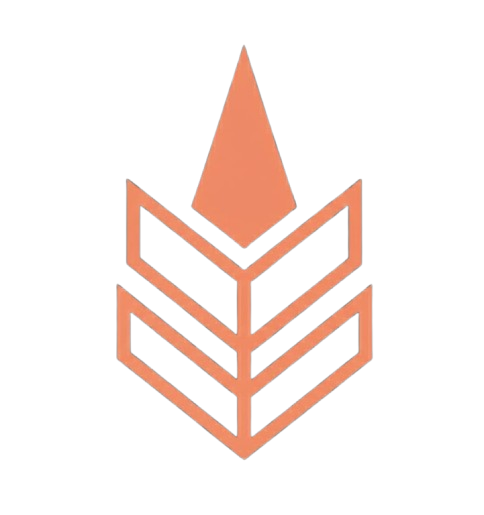

# Ember

Ember is the SRAD flight computer system of the IITB Rocket Team, developed as an experimental platform with mitigations for issues faced by previous systems and as a testbed for new avionics architecture.

## Version Descriptions

### Ember Pilot
Proof of concept version validating new LoRa telemetry and core sensor suite. Features a Raspberry Pi Pico 2 dev board instead of a bare-metal hardware design. All systems validated for future versions.

| Parameter | Details |
|-----------|---------|
| MCU | RP2350A (Pico 2 dev board) |
| Layers | 4 |
| Sensors | BMP280, BNO055, KX134 |
| GNSS | Teseo LIV3F |
| Telemetry | Waveshare Core SX1262 (920MHz LoRa) |

---

### Ember V0.2 (Ember)
First full flight version. Flew successfully at IREC 2026, reaching an apogee of 9,463 ft with a SRAD N-class KNSB motor — 2% overshoot on OpenRocket predicted apogee of 9,272 ft. Split into two boards: Flight Computer Unit (FCU) and Telemetry & Data Unit (TDU).

| Parameter | Details |
|-----------|---------|
| FCU MCU | RP2350A (Pico 2 dev board) |
| TDU MCU | RP2350A (Pico 2 dev board) |
| Layers | 2 |
| Sensors | BMP280, BNO055, KX134, NXP MPXV5100DP |
| GNSS | Quectel L89HA (multi-constellation) |
| Telemetry | Waveshare Core1262 SX1262 (920MHz LoRa) |
| Recovery | Dual deploy — drogue at apogee, main at 400m AGL |
| Pyro channels | 4 (2 primary, 2 redundant) |
| Data logging | External flash |
| COTS backup | EasyMini V2 |

---

### Ember V1 (In Development)
Major architectural redesign with full separation of concerns across dedicated board types. Introduces triple modular redundant recovery, distributed CAN bus architecture, and significantly upgraded data acquisition.

**Board types:**

**NTDU (Navigation, Telemetry & Data Unit)** — main board. Independent sensor suite for navigation and state estimation, GNSS, LoRa telemetry, data acquisition (dp probe, strain gauges), configuration authority for all nodes on boot, aggregates and logs data from all CAN nodes.

| Parameter | Details |
|-----------|---------|
| MCU | STM32H573 |
| Sensors | BMP384, BNO055, KX134, NXP MPXV5100DP (via ADS1220), BX350-3AA strain gauges (via ADS1220) |
| GNSS | Quectel L89HA |
| Telemetry | SX1262 920MHz LoRa |
| Data logging | OctoSPI NOR flash + microSD |
| Communication | CAN bus (all nodes) |
| Power | 2S Li-ion, AP63205WU buck (5V) |

**RU (Recovery Unit) — x3** — dedicated recovery boards in triple modular redundant configuration. Distributed 2-of-3 voting via CAN bus. Each board independently detects apogee and participates in consensus voting.

| Parameter | Details |
|-----------|---------|
| MCU | STM32F411 |
| Sensors | BMP280, single-axis accelerometer |
| Pyro channels | 2 (drogue + main) |
| Communication | CAN bus (shared with NTDU) |
| RTOS | FreeRTOS |
| Power | 1S Li-ion (isolated per board) |
| Voting | 2-of-3 mid-value select consensus |
